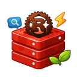

<p align="center">
  
</p>

<h1 align="center">Rust Redis Desktop</h1>

<p align="center">A desktop Redis manager built with Rust, Dioxus, and Freya.</p>

<table>
  <tr>
    <th>Json</th>
    <th>Hash/Set/Zset/List</th>
  </tr>
  <tr>
    <td>
      
    </td>
    <td>
      
    </td>
  </tr>
  <tr>
    <th>Image</th>
    <th>Stream</th>
  </tr>
  <tr>
    <td>
      
    </td>
    <td>
      
    </td>
  </tr>
  <tr>
    <th>Java Serialization</th>
    <th>Multiple Themes</th>
  </tr>
  <tr>
    <td>
      
    </td>
    <td>
      
    </td>
  </tr>
</table>

## Features

### Connection Management

- Multiple saved Redis connections
- Direct, Cluster, and Sentinel connection modes
- SSL/TLS support
- SSH tunnel support
- Read-only connection flag
- Drag-and-drop connection ordering
- Connection import/export as JSON
- Stored credentials are encrypted before being written to local config

### Data Browsing and Editing

- Key browser with incremental scan and pattern search
- Add, edit, delete, and batch-delete keys
- Batch TTL operations
- Type-aware viewers and editors for:
  - String
  - Hash
  - List
  - Set
  - ZSet
  - Stream
  - Bitmap
- JSON formatting and structured viewing
- Image preview support for binary values

### Inspection and Operations

- Redis command terminal with:
  - command execution
  - command suggestions
  - inline help via `HELP <command>`
  - persisted command history
- Lua script panel for `EVAL`, `SCRIPT LOAD`, and `SCRIPT FLUSH`
- Pub/Sub panel for publishing and subscribing
- Slowlog viewer
- Client list viewer with client kill action
- Server info panel
- Monitor panel for memory and OPS trends
- Memory analysis by key and prefix

### Serialization and Value Decoding

- Automatic detection and decoding helpers for several formats, including:
  - Java serialization
  - Protobuf
  - MsgPack
  - CBOR
  - BSON
  - PHP serialization
  - Python Pickle
  - Kryo / FST
- Protobuf schema import from `.proto` files

### Application UX

- Built-in light/dark theme system with multiple palettes
- System-following theme mode
- Automatic update checks
- System tray support on macOS and Windows

## Installation

Download a prebuilt package from the [Releases](https://github.com/yelog/rust-redis-desktop/releases) page, or build from source.

Release artifacts currently include:

- macOS `.dmg`
- Windows installer `.exe`
- Linux `.AppImage`
- Linux `.deb`

## Build From Source

### Prerequisites

- A recent Rust toolchain with `cargo`
- Platform GUI dependencies

Linux builds require additional system packages. The release workflow currently installs:

```sh
sudo apt-get update
sudo apt-get install -y \
  libgtk-3-dev \
  libwebkit2gtk-4.1-dev \
  libappindicator3-dev \
  librsvg2-dev \
  patchelf \
  libgl1-mesa-dev \
  libxcb-render0-dev \
  libxcb-shape0-dev \
  libxcb-xfixes0-dev \
  libxkbcommon-dev \
  libssl-dev \
  pkg-config \
  file \
  desktop-file-utils \
  libxdo-dev \
  libfuse2
```

### Build and Run

```sh
git clone https://github.com/yelog/rust-redis-desktop.git
cd rust-redis-desktop
cargo run
```

For a release build:

```sh
cargo build --release
```

The produced binary is:

```sh
./target/release/rust-redis-desktop
```

## Configuration

The app stores its local state under the platform config directory used by `dirs::config_dir()`.

Typical locations:

```text
Linux:   ~/.config/rust-redis-desktop/config.json
macOS:   ~/Library/Application Support/rust-redis-desktop/config.json
Windows: %AppData%\rust-redis-desktop\config.json
```

The configuration file contains saved connections, application settings, and command history.

Example:

```json
{
  "connections": [],
  "settings": {
    "auto_refresh_interval": 0,
    "theme_preference": {
      "system": {
        "light": "tokyo_night_light",
        "dark": "tokyo_night"
      }
    },
    "auto_check_updates": true
  },
  "command_history": {
    "entries": [],
    "favorites": []
  }
}
```

Notes:

- The project currently uses `config.json`, not `config.toml`.
- Theme preference is persisted as structured JSON.
- Connection credentials are encrypted before being saved.
- There is no documented runtime configuration via environment variables at the moment.

## Project Focus

The current codebase is strongest in these areas:

- Managing multiple Redis connections from a desktop UI
- Inspecting and editing common Redis data structures
- Working with operational tooling such as slowlog, clients, monitoring, and memory analysis
- Exploring serialized or binary payloads without leaving the app

Areas still improving:

- Overall polish and consistency across all panels
- Documentation depth
- Some incomplete UI flows marked in-app as in progress

## Contributing

Issues and pull requests are welcome. If you plan to contribute, please open an issue first for larger changes so the direction can be aligned before implementation.

## License

This project is licensed under the MIT License. See [LICENSE](./LICENSE).
