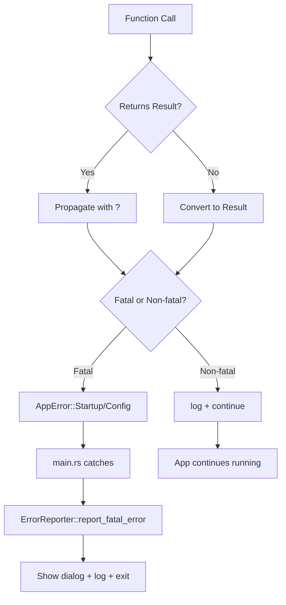

# Error Handling Refactor Design

**Date**: 2026-04-02  
**Status**: Approved  
**Author**: Sisyphus  
**Phase**: Phase 1 - Stability Fix  

---

## Overview

This document outlines the design for refactoring error handling in Rust Redis Desktop to eliminate unsafe `.unwrap()` and `.expect()` calls that can cause runtime panics. The refactor follows a **mixed mode** approach where core functionality failures terminate the application gracefully, while non-core functionality failures allow degraded operation.

---

## Problem Statement

### Current Issues

1. **76 `.unwrap()` calls** in production code across 16 files
2. **5 `.expect()` calls** that can panic at runtime
3. **4 unsafe unwraps** that can crash during normal operation:
   - `tray.rs:82` - Mutex lock poisoning
   - `updater/manager.rs:85` - Default implementation with expect
   - `updater/downloader.rs:103` - Default implementation with expect
   - `config/storage.rs:228` - Default implementation with expect
4. **5 medium-risk unwraps** in startup code
5. **No unified error type hierarchy** - only `ConnectionError` and `UpdateError` exist
6. **Mixed error languages** - English in `ConnectionError`, Chinese in `UpdateError`

### Risk Assessment

| Category | Count | Risk Level | Impact |
|----------|-------|------------|--------|
| Unsafe unwraps | 4 | 🔴 Critical | App crash during operation |
| Medium-risk unwraps | 5 | 🟡 Medium | App crash on startup |
| Safe unwraps | 7 | 🟢 Low | Properly guarded |
| Language inconsistency | 2 files | 🟡 Medium | Poor UX |

---

## Design Goals

### Primary Goals
1. ✅ Eliminate all unsafe `.unwrap()` and `.expect()` calls in production code
2. ✅ Create unified error type hierarchy with `AppError` as the root
3. ✅ Implement error reporting infrastructure (dialog + log + terminal)
4. ✅ Separate fatal errors (core functionality) from non-fatal errors (degraded mode)
5. ✅ Standardize error messages to English (or proper i18n)

### Non-Goals
- Refactoring all error handling in the codebase (focus on critical paths only)
- Adding retry logic for transient failures
- Implementing error recovery strategies
- Refactoring test code

---

## Design Decisions

### Decision 1: Mixed Mode Error Handling

**Chosen Approach**: Hybrid mode - core failures exit, non-core failures degrade

**Rationale**:
- Desktop applications must be usable when core features work
- Tray icon, update checker failures shouldn't block app startup
- Menu, window creation failures make app unusable → must exit

**Implementation**:
```rust
// Fatal error example (menu creation)
let menu = create_menu()
    .map_err(|e| AppError::Startup(StartupError::MenuCreation { source: e }))?;

// Non-fatal error example (tray initialization)
if let Err(e) = init_tray(tray_state) {
    non_fatal_error!("System tray", &e);
    // Continue running without tray icon
}
```

---

### Decision 2: Combined Error Reporting

**Chosen Approach**: Native dialog + log file + terminal output

**Rationale**:
- **Dialog**: Users see errors immediately
- **Log file**: Persists for debugging and support
- **Terminal**: Developers see errors during development

**Implementation**:
```rust
ErrorReporter::report_fatal_error(&error) {
    // 1. Terminal output
    eprintln!("FATAL ERROR: {}", error);
    
    // 2. Log file
    write_error_log(&error);
    
    // 3. Native dialog
    rfd::MessageDialog::new()
        .set_level(rfd::MessageLevel::Error)
        .set_description(&error.to_string())
        .show();
    
    // 4. Exit
    std::process::exit(1);
}
```

---

### Decision 3: Hierarchical Error Types

**Chosen Approach**: Layered error types with `AppError` as root

**Structure**:
```
AppError (root)
├── StartupError (fatal)
│   ├── MenuCreation
│   ├── RuntimeInit
│   └── WindowCreation
├── ConnectionError (existing)
├── UpdateError (existing)
├── ConfigError (new)
│   ├── DirectoryAccess
│   ├── ReadError
│   └── WriteError
└── Other (catch-all)
```

**Rationale**:
- Type-safe error handling with pattern matching
- Automatic error conversion via `#[from]` trait
- Clear error categories for logging and reporting
- Extensible for future error types

---

### Decision 4: Standard Error Context

**Chosen Approach**: Error type + source error chain

**Rationale**:
- Provides enough context for debugging
- Doesn't overwhelm with unnecessary details
- Backtrace available when `RUST_BACKTRACE=1` is set

**Implementation**:
```rust
#[error("Failed to create menu: {source}")]
MenuCreation {
    #[source]
    source: Box<dyn std::error::Error + Send + Sync>,
}
```

---

## Architecture

### Component Overview

```
┌─────────────────────────────────────────────────────────────┐
│                         main.rs                             │
│  ┌──────────────────────────────────────────────────────┐  │
│  │ run_app() -> Result<()>                              │  │
│  │  - Initialize logger                                 │  │
│  │  - Create menu (fatal)                               │  │
│  │  - Load config (non-fatal)                           │  │
│  │  - Create window (fatal)                             │  │
│  │  - Init tray (non-fatal)                             │  │
│  │  - Launch UI (fatal)                                 │  │
│  └──────────────────────────────────────────────────────┘  │
└─────────────────────────────────────────────────────────────┘
                           │
                           ▼
┌─────────────────────────────────────────────────────────────┐
│                    error_reporting.rs                       │
│  - ErrorReporter::report_fatal_error()                      │
│  - ErrorReporter::report_non_fatal_error()                  │
│  - write_error_log()                                        │
│  - show_error_dialog()                                      │
└─────────────────────────────────────────────────────────────┘
                           │
                           ▼
┌─────────────────────────────────────────────────────────────┐
│                       error.rs                              │
│  AppError                                                   │
│  ├── StartupError                                          │
│  ├── ConfigError                                           │
│  ├── ConnectionError (existing)                            │
│  └── UpdateError (existing)                                │
└─────────────────────────────────────────────────────────────┘
```

### Error Flow



---

## Implementation Details

### 1. Error Type Hierarchy

#### `src/error.rs` (new file)

```rust
use thiserror::Error;

/// Top-level application error
#[derive(Error, Debug)]
pub enum AppError {
    #[error("Startup failed: {0}")]
    Startup(#[from] StartupError),
    
    #[error("Connection error: {0}")]
    Connection(#[from] ConnectionError),
    
    #[error("Update error: {0}")]
    Update(#[from] UpdateError),
    
    #[error("Configuration error: {0}")]
    Config(#[from] ConfigError),
    
    #[error("{0}")]
    Other(String),
}

/// Startup errors (core functionality - fatal)
#[derive(Error, Debug)]
pub enum StartupError {
    #[error("Failed to create menu: {source}")]
    MenuCreation {
        #[source]
        source: Box<dyn std::error::Error + Send + Sync>,
    },
    
    #[error("Failed to initialize runtime: {source}")]
    RuntimeInit {
        #[source]
        source: Box<dyn std::error::Error + Send + Sync>,
    },
    
    #[error("Failed to create window: {source}")]
    WindowCreation {
        #[source]
        source: Box<dyn std::error::Error + Send + Sync>,
    },
}

/// Configuration errors
#[derive(Error, Debug)]
pub enum ConfigError {
    #[error("Failed to access config directory: {0}")]
    DirectoryAccess(String),
    
    #[error("Failed to read config file: {0}")]
    ReadError(String),
    
    #[error("Failed to write config file: {0}")]
    WriteError(String),
    
    #[error("Invalid configuration: {0}")]
    InvalidConfig(String),
}

/// Global Result type alias
pub type Result<T> = std::result::Result<T, AppError>;
```

---

### 2. Error Reporting Infrastructure

#### `src/error_reporting.rs` (new file)

```rust
use crate::error::AppError;
use std::path::PathBuf;
use tracing::error;

pub struct ErrorReporter {
    log_dir: PathBuf,
}

impl ErrorReporter {
    pub fn init() -> Self {
        let log_dir = dirs::config_dir()
            .unwrap_or_else(|| PathBuf::from("."))
            .join("rust-redis-desktop")
            .join("logs");
        
        let _ = std::fs::create_dir_all(&log_dir);
        
        Self { log_dir }
    }
    
    pub fn report_fatal_error(error: &AppError) -> ! {
        let error_msg = format!("{}", error);
        let detailed_msg = format!("{:#?}", error);
        
        // 1. Terminal
        eprintln!("\n========================================");
        eprintln!("FATAL ERROR: {}", error_msg);
        eprintln!("========================================\n");
        eprintln!("Details:\n{}\n", detailed_msg);
        
        // 2. Log file
        if let Some(log_path) = Self::write_error_log(&error_msg, &detailed_msg) {
            eprintln!("Error log saved to: {:?}\n", log_path);
        }
        
        // 3. Native dialog
        Self::show_error_dialog(&error_msg);
        
        // 4. Exit
        std::process::exit(1);
    }
    
    pub fn report_non_fatal_error(context: &str, error: &dyn std::error::Error) {
        error!("Non-fatal error in {}: {}", context, error);
        eprintln!("[WARN] {} failed: {}", context, error);
    }
    
    fn write_error_log(summary: &str, details: &str) -> Option<PathBuf> {
        let timestamp = chrono::Local::now().format("%Y%m%d_%H%M%S");
        let log_file = dirs::config_dir()?
            .join("rust-redis-desktop")
            .join("logs")
            .join(format!("error_{}.log", timestamp));
        
        let content = format!(
            "Redis Desktop - Fatal Error Log\n\
             Generated: {}\n\
             \n\
             Error Summary:\n{}\n\
             \n\
             Full Details:\n{}\n\
             \n\
             Backtrace:\n{:?}\n",
            chrono::Local::now().format("%Y-%m-%d %H:%M:%S"),
            summary,
            details,
            std::backtrace::Backtrace::capture()
        );
        
        std::fs::write(&log_file, content).ok()?;
        Some(log_file)
    }
    
    fn show_error_dialog(message: &str) {
        let _ = rfd::MessageDialog::new()
            .set_level(rfd::MessageLevel::Error)
            .set_title("Redis Desktop - Startup Error")
            .set_description(message)
            .set_buttons(rfd::MessageButtons::Ok)
            .show();
    }
}

#[macro_export]
macro_rules! fatal_error {
    ($error:expr) => {
        $crate::error_reporting::ErrorReporter::report_fatal_error(&$error)
    };
}

#[macro_export]
macro_rules! non_fatal_error {
    ($context:expr, $error:expr) => {
        $crate::error_reporting::ErrorReporter::report_non_fatal_error(
            $context,
            &$error
        )
    };
}
```

---

### 3. Main.rs Refactor

#### Changes to `src/main.rs`

**Before**:
```rust
fn create_menu() -> Menu {
    let menu = Menu::new();
    app_menu.append_items(&[...]).unwrap();
    menu
}

fn main() {
    // Direct unwrap calls
    let rt = tokio::runtime::Runtime::new().unwrap();
    let menu = create_menu();
    // ...
}
```

**After**:
```rust
fn create_menu() -> std::result::Result<Menu, Box<dyn std::error::Error + Send + Sync>> {
    let menu = Menu::new();
    app_menu.append_items(&[...])?;
    Ok(menu)
}

fn main() {
    let _reporter = ErrorReporter::init();
    
    if let Err(e) = run_app() {
        ErrorReporter::report_fatal_error(&e);
    }
}

fn run_app() -> Result<()> {
    // Non-fatal: update checker
    if let Ok(mut manager) = UpdateManager::new() {
        if manager.should_auto_check() {
            match tokio::runtime::Runtime::new() {
                Ok(rt) => { /* spawn update checker */ },
                Err(e) => non_fatal_error!("Update checker runtime", &e),
            }
        }
    }
    
    // Fatal: menu creation
    let menu = create_menu()
        .map_err(|e| AppError::Startup(StartupError::MenuCreation { source: e }))?;
    
    // Non-fatal: tray
    if let Err(e) = init_tray(tray_state) {
        non_fatal_error!("System tray", &e);
    }
    
    // ... launch UI
    Ok(())
}
```

---

### 4. Unsafe Unwrap Fixes

#### 4.1 `src/tray.rs`

**Before**:
```rust
pub fn init_tray(state: SharedTrayState) {
    let icon = load_icon(); // panics on failure
    // ...
    let mut s = state.lock().unwrap(); // panics on poisoning
}
```

**After**:
```rust
pub fn init_tray(state: SharedTrayState) -> Result<()> {
    let icon = load_icon()
        .map_err(|e| AppError::Other(format!("Failed to load tray icon: {}", e)))?;
    
    // ...
    
    match state.lock() {
        Ok(mut s) => {
            s.active_server_id = Some(server_id.to_string());
        }
        Err(poisoned) => {
            // Recover from poisoned mutex
            let mut s = poisoned.into_inner();
            s.active_server_id = Some(server_id.to_string());
            tracing::warn!("Tray state mutex was poisoned, recovered");
        }
    }
    
    Ok(())
}

fn load_icon() -> std::result::Result<Icon, Box<dyn std::error::Error>> {
    let icon_bytes = include_bytes!("../icons/icon.png");
    let img = image::load_from_memory(icon_bytes)?;
    let rgba = img.to_rgba8();
    let (width, height) = rgba.dimensions();
    Ok(Icon::from_rgba(rgba.into_raw(), width, height)?)
}
```

---

#### 4.2 Remove Unsafe Default Implementations

**Files affected**:
- `src/config/storage.rs`
- `src/updater/manager.rs`
- `src/updater/downloader.rs`

**Before**:
```rust
impl Default for ConfigStorage {
    fn default() -> Self {
        Self::new().expect("Failed to create config storage")
    }
}
```

**After**:
```rust
// Remove Default implementation entirely
impl ConfigStorage {
    pub fn new() -> Result<Self> {
        let config_dir = dirs::config_dir()
            .ok_or_else(|| ConfigError::DirectoryAccess("Cannot determine config directory".into()))?;
        
        std::fs::create_dir_all(&config_dir)
            .map_err(|e| ConfigError::DirectoryAccess(format!("Failed to create config directory: {}", e)))?;
        
        Ok(Self { /* ... */ })
    }
}
```

**Rationale**: Forcing fallible operations into an infallible trait (`Default`) causes panics when file system errors occur.

---

### 5. Safe Unwrap Improvements

#### 5.1 `src/serialization/mod.rs`

**Before**:
```rust
return full_name.strip_prefix("java.lang.").unwrap().to_string();
parts.last().unwrap().to_string()
```

**After**:
```rust
// Guarded by if check - safe to keep
return full_name.strip_prefix("java.lang.").unwrap_or(full_name).to_string();

// Add fallback
parts.last().unwrap_or(&full_name).to_string()
```

---

#### 5.2 `src/protobuf_schema/parser.rs`

**Before**:
```rust
regex::Regex::new(r#"..."#).unwrap()  // In function body
```

**After**:
```rust
use once_cell::sync::Lazy;

// Compile once at startup
static IMPORT_REGEX: Lazy<regex::Regex> = Lazy::new(|| {
    regex::Regex::new(r#"import\s+(?:public\s+)?["']([^"']+)["']\s*;"#)
        .expect("Static regex pattern should always compile")
});
```

**Rationale**: Static patterns should always compile. Using `Lazy` caches the regex and `expect` provides clear error message if pattern is invalid.

---

## Migration Path

### Phase 1: Create Foundation (Day 1)
1. Create `src/error.rs`
2. Create `src/error_reporting.rs`
3. Update `src/lib.rs` to export new modules
4. Test error reporting infrastructure in isolation

### Phase 2: Fix Critical Unwraps (Day 1)
1. Remove `Default` implementations from:
   - `ConfigStorage`
   - `UpdateManager`
   - `UpdateDownloader`
2. Update their `new()` methods to return `Result`
3. Fix `tray.rs` mutex handling

### Phase 3: Refactor Main (Day 2)
1. Convert `create_menu()` to return `Result`
2. Create `run_app()` function
3. Separate fatal/non-fatal initialization
4. Wire up error reporting

### Phase 4: Improve Safe Unwraps (Day 2)
1. Add fallbacks to guarded unwraps
2. Convert regex to `Lazy` static
3. Handle system time errors gracefully

### Phase 5: Testing & Validation (Day 2)
1. Test startup with missing config directory
2. Test startup with corrupted config
3. Test tray initialization failure
4. Test menu creation failure
5. Verify error dialogs appear
6. Check error logs are created

---

## Testing Strategy

### Unit Tests

```rust
#[cfg(test)]
mod tests {
    use super::*;
    
    #[test]
    fn test_error_conversion() {
        let config_err = ConfigError::DirectoryAccess("test".into());
        let app_err: AppError = config_err.into();
        assert!(matches!(app_err, AppError::Config(_)));
    }
    
    #[test]
    fn test_mutex_poisoning_recovery() {
        let state = create_shared_state();
        // Simulate poisoning
        std::thread::spawn({
            let state = state.clone();
            move || {
                let _lock = state.lock().unwrap();
                panic!("Intentional panic");
            }
        }).join().unwrap_err();
        
        // Should recover
        let recovered = state.lock().unwrap_or_else(|e| e.into_inner());
        assert!(recovered.servers.is_empty());
    }
}
```

### Integration Tests

1. **Missing config directory**: Should create default settings
2. **Permission denied**: Should show error dialog
3. **Corrupted config file**: Should fall back to defaults
4. **Tray icon missing**: Should start without tray
5. **Menu creation failure**: Should exit with error dialog

---

## Success Criteria

### Functional Requirements
- ✅ No panics from `.unwrap()` or `.expect()` in production code
- ✅ Fatal errors show dialog + log + exit(1)
- ✅ Non-fatal errors log warning + continue
- ✅ Error logs contain full backtrace and details
- ✅ All error messages in English (or via i18n)

### Non-Functional Requirements
- ✅ Startup time unchanged (< 1s)
- ✅ Error dialog appears within 100ms
- ✅ Log files written to OS-appropriate directory
- ✅ No performance regression in hot paths

### Quality Metrics
- ✅ 0 unsafe unwraps in production code
- ✅ 100% of fatal errors reported via `ErrorReporter`
- ✅ Error types have clear, actionable messages
- ✅ Code passes `cargo clippy` without warnings

---

## Risks and Mitigation

| Risk | Impact | Likelihood | Mitigation |
|------|--------|------------|------------|
| Breaking existing functionality | High | Medium | Comprehensive testing, incremental rollout |
| Performance degradation | Low | Low | Benchmark before/after |
| Missing edge cases | Medium | Medium | Code review, manual testing |
| User confusion from new error dialogs | Low | Low | Clear, actionable error messages |

---

## Future Enhancements

### Not in Scope (Phase 1)
1. **Retry logic** for transient failures
2. **Error recovery** strategies (e.g., reset config on corruption)
3. **Telemetry** for error tracking
4. **Localized error messages** via i18n system
5. **Error aggregation** for batch operations

### Planned for Phase 2
1. Extend error types for Redis operations
2. Add retry logic for network failures
3. Implement circuit breaker pattern
4. Add telemetry for error tracking

---

## References

- Rust Error Handling Best Practices: https://doc.rust-lang.org/book/ch09-00-error-handling.html
- thiserror crate: https://docs.rs/thiserror
- anyhow crate: https://docs.rs/anyhow
- rfd (Rust File Dialog): https://docs.rs/rfd

---

## Appendix: Full File Changes

### Files Modified (11 total)
1. `src/main.rs` - Use Result, separate fatal/non-fatal
2. `src/lib.rs` - Export error modules
3. `src/tray.rs` - Return Result, handle mutex poisoning
4. `src/config/storage.rs` - Return Result, remove Default
5. `src/updater/manager.rs` - Return Result, remove Default
6. `src/updater/downloader.rs` - Return Result, remove Default
7. `src/serialization/mod.rs` - Improve unwrap safety
8. `src/protobuf_schema/parser.rs` - Static regex + Result
9. `src/protobuf_schema/registry.rs` - try_into instead of unwrap
10. `src/ui/pubsub_panel.rs` - unwrap_or_else for clock
11. `src/ui/monitor_panel.rs` - unwrap_or_else for clock

### Files Created (2 total)
1. `src/error.rs` - Unified error types
2. `src/error_reporting.rs` - Error reporting infrastructure

### Files Deleted (0 total)
No files deleted, only implementations removed from existing files.